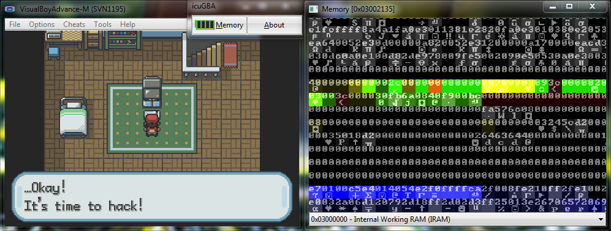

# icuGBA

One of my old Game Boy Advance romhacking tools from 2011, a GBA clone of mathfigure's ICU64. Not maintained anymore.

## How it works
It's a parasitic DLL written in [FPC/Lazarus](https://www.lazarus-ide.org/) that leeches on an old version of [VisualBoyAdvance-M](https://github.com/visualboyadvance-m/visualboyadvance-m).
